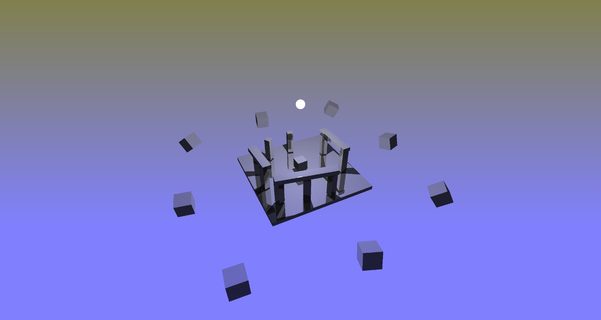
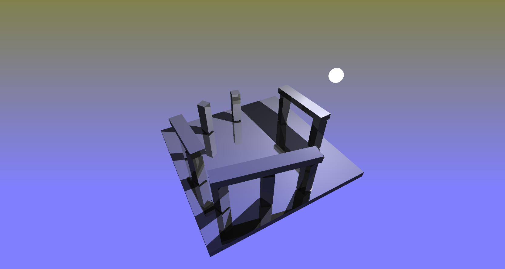
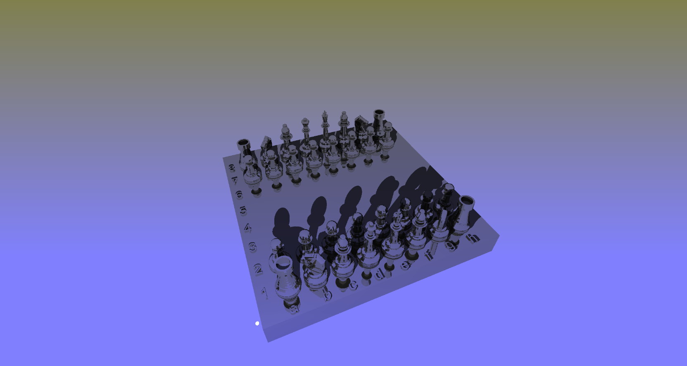

# WEBGPU LBVH RTRT demo

base webgpu LBVH builder forked from [here](https://github.com/AddisonPrairie/WebGPU-LVBH-demo)

and optimized by RayTraceX for real-time ray-tracing (with dynamic scenes)

LBVH build time on Vega7 (5600G iGPU) :

[264 tris] scene 1 (animation) 2.9 ms

[156 tris] scene 2 (simple) 2.2-2.7 ms

[218,724 tris] scene 3 (chess) 12.5 ms

You can try the demo [here](https://raytracex.github.io/webgpuRTRT-LBVH/) - just load scene by button (or just drag and drop an .obj model)
